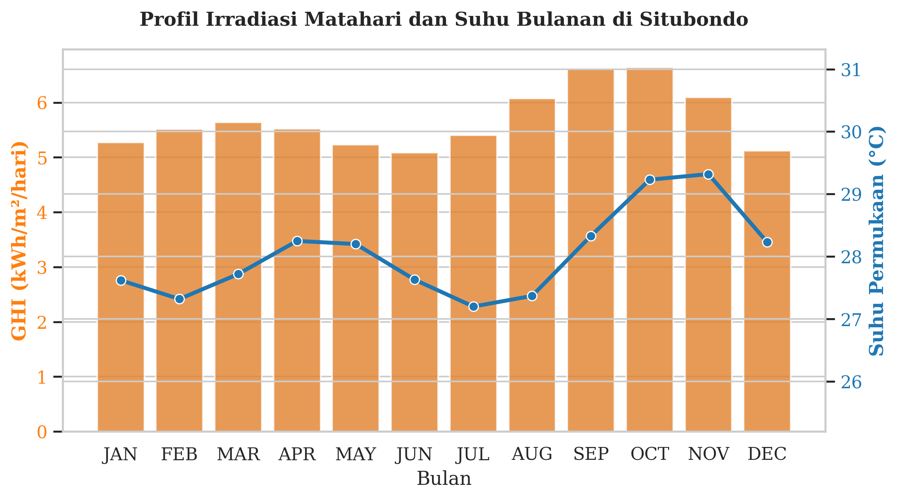
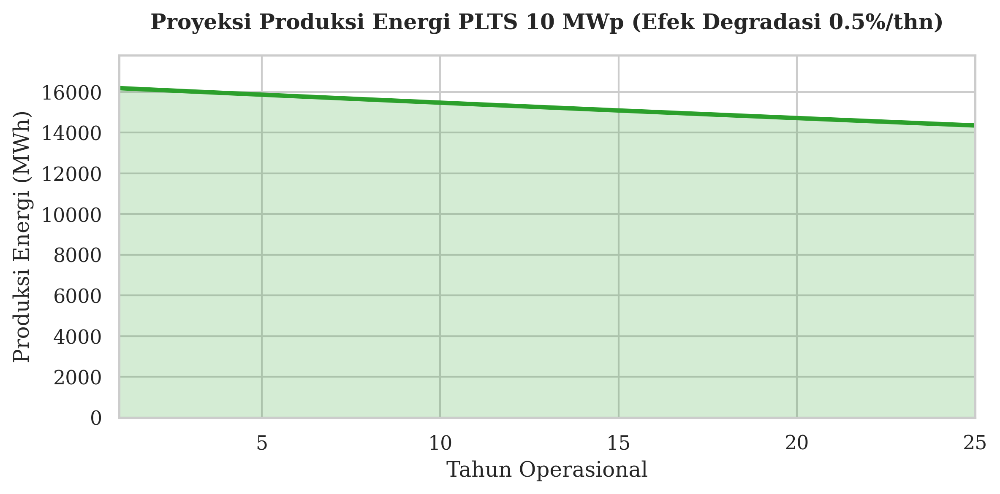
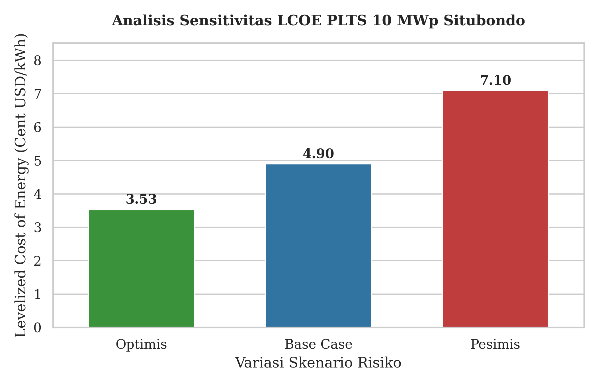

# ☀️ Techno-Economic Analysis of a 10 MWp Utility-Scale Solar PV Plant in Situbondo

**Author:** Regan Agam (Student ID: 24/PTK/552177/16439)  
**Program:** Master's in Electrical Engineering, Universitas Gadjah Mada (UGM)  
**Course:** New and Renewable Energy (Energi Baru dan Terbarukan / EBT)

## 📌 Project Overview
The energy transition towards Net Zero Emission (NZE) 2060 demands the rapid acceleration of Solar Photovoltaic (PV) infrastructure. This project presents a comprehensive techno-economic feasibility analysis for the design of a **10 MWp** utility-scale solar power plant in Situbondo Regency, East Java, Indonesia.

Situbondo was strategically selected due to its consistently high solar irradiance and the availability of marginal, rocky savanna land, ensuring that the development does not disrupt agricultural productivity. The project also formulates risk mitigation strategies concerning cost fluctuations (Levelized Cost of Energy / LCOE), regulatory challenges (such as Local Content Requirements / TKDN), and grid integration issues (e.g., the Duck Curve phenomenon).

## 🌍 Climatology Analysis & Energy Potential
Climatological data was extracted using the **NASA Prediction of Worldwide Energy Resources (POWER)** API to establish a P50 energy production baseline (50% probability of exceedance), which is highly robust against extreme annual weather anomalies.

*   **Location Coordinates:** -7.7081, 114.0044 (Situbondo, East Java).
*   **Historical Average GHI:** 5.68 kWh/m²/day.

The chart below illustrates an ideal monthly profile, where high irradiance occurs consistently throughout the year, peaking during the dry-to-wet transition month (October).

## 🛠️ Technical Performance (25-Year Lifespan)
Accounting for technical metrics and solar panel degradation factors, the 10 MWp Solar PV plant is estimated to perform as follows:

*   **1st Year Energy Production:** 16,180.02 MWh.
*   **Capacity Factor (CF):** 18.47% (highly favorable for a non-tracking PV system in Southeast Asia).
*   **Land Requirement:** ~10 - 12 Hectares.
*   **Degradation Rate:** 0.5% per year.

The energy production is calculated to remain solid to support the regional grid until the end of the project's life cycle (year 25), as visualized below:

## 💰 Economic Sensitivity Analysis (LCOE)
The Levelized Cost of Energy (LCOE) was calculated by comparing three macroeconomic and policy scenarios (assuming a 25-year project lifespan and 1.5% OPEX).

1.  **Optimistic Scenario (Full government support, low interest):** LCOE drops significantly to **3.53 Cents USD/kWh**, making the project highly bankable.
2.  **Base Case Scenario (Current conditions):** LCOE stands at **4.90 Cents USD/kWh** (highly competitive and cheaper than the Generation Cost of local coal power plants).
3.  **Pessimistic Scenario (High interest rates & CAPEX inflation due to strict TKDN):** LCOE surges to **7.10 Cents USD/kWh**, indicating a high investment risk without the presence of innovative financing schemes.

## 💡 Implementation Strategy & Risk Mitigation
To ensure this project can serve as a robust backbone for the NZE 2060 target, the following strategic roadmap is proposed:

1.  **Short-Term (Regulation):** Providing a temporary relaxation of Local Content Requirement (TKDN) quotas for pioneer renewable projects. This will reduce the premium cost on initial CAPEX, stimulate Foreign Direct Investment (FDI), and accelerate green capacity building.
2.  **Medium-Term (Technology):** Mandating the integration of **Battery Energy Storage Systems (BESS)**. BESS will store excess daytime power and distribute it stably during nighttime peak hours, transforming the PV plant from a variable renewable source into a reliable baseload generator and addressing the Duck Curve issue.
3.  **Long-Term (Expansion):** Once the grid reaches over-capacity, the strategic move involves converting excess curtailed energy during peak daytime hours into electrolyzer facilities to produce **Green Hydrogen**. This acts as a boundless seasonal chemical storage that can be exported globally or utilized in eco-friendly gas turbines.
